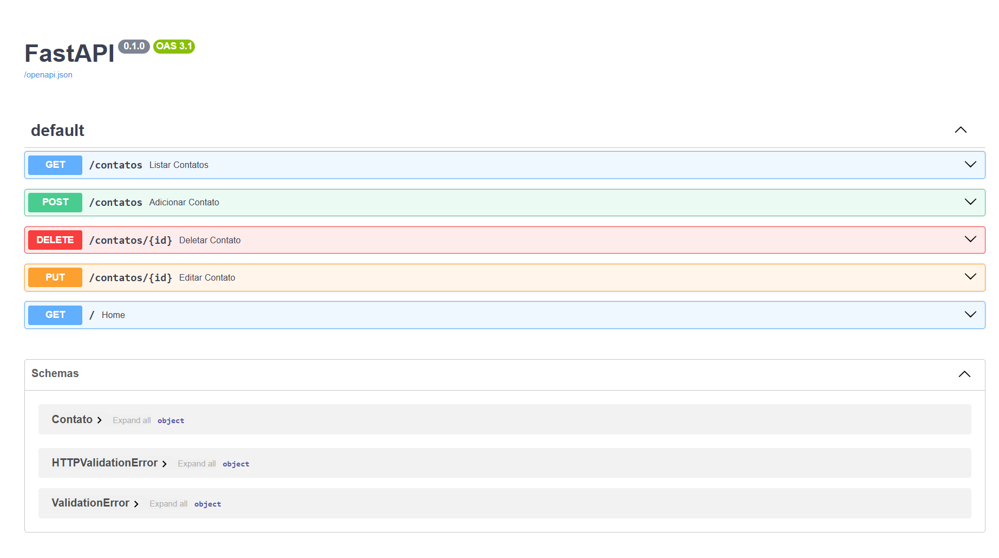

# API de Contatos 📇

Projeto desenvolvido com foco em back-end utilizando FastAPI, com implementação de uma API REST para gerenciamento de contatos.

A aplicação permite realizar operações completas de CRUD (criação, leitura, atualização e remoção), além de aplicar validação de dados, organização em camadas e boas práticas de estruturação de código.

Este projeto foi desenvolvido como parte da minha evolução na área de desenvolvimento back-end, com objetivo de consolidar conceitos fundamentais e boas práticas utilizadas no mercado.

## 🚀 Tecnologias utilizadas
- Python
- FastAPI
- Pydantic
- JSON

## 📌 Funcionalidades
- Criar contato (POST)
- Listar contatos (GET)
- Atualizar contato (PUT)
- Remover contato (DELETE)
- Validação de email

## 📂 Estrutura do projeto

api-contatos/
├── main.py
├── routes.py
├── models.py
├── database.py
├── contatos.json

## 📥 Exemplo de requisição

POST /contatos

{
  "nome": "Murilo",
  "email": "murilo@email.com"
}

## ▶️ Como executar o projeto

pip install -r requirements.txt  
uvicorn main:app --reload
Acesse:
http://127.0.0.1:8000/docs

## 📷 Demonstração

## 📈 Melhorias futuras
- Integração com banco de dados (SQLite)
- Autenticação de usuários
- Deploy da aplicação

## 📷 Testando a API

Acesse a documentação interativa:
http://127.0.0.1:8000/docs